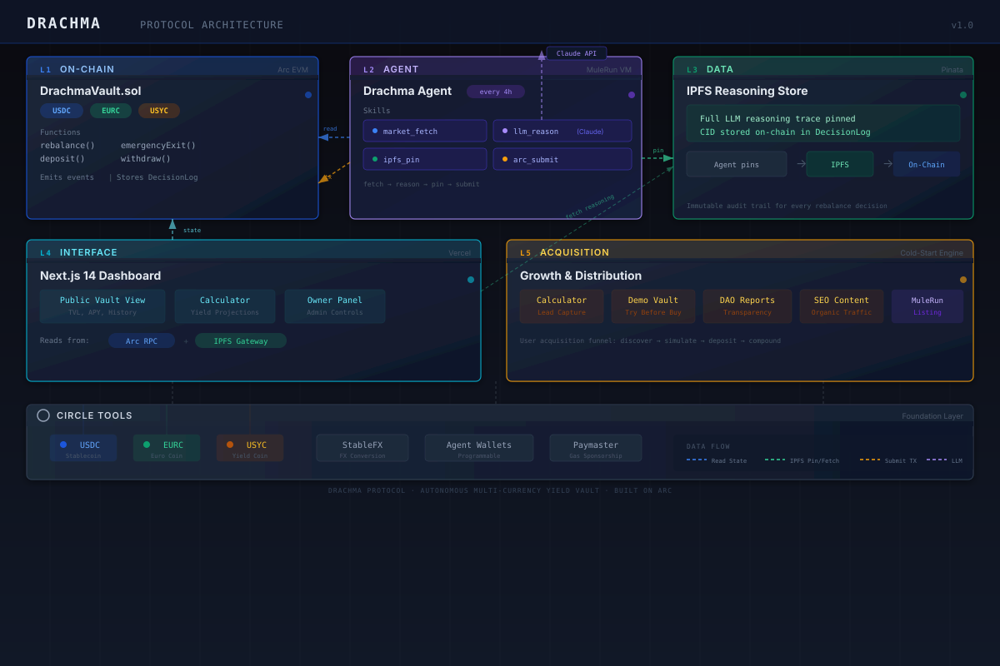

# DRACHMA

**Autonomous Stablecoin Reserve Manager on Arc (Circle L1)**

[GitHub](https://github.com/0xCaptain888/drachma-arc)

---

## One-Sentence Pitch

Drachma is an AI agent that autonomously manages stablecoin reserves across USDC, EURC, and USYC on Arc -- eliminating FX exposure loss, idle yield loss, and liquidity timing loss for global freelancers, remote teams, and DAO treasuries.

---

## Problem

Global stablecoin holders face three compounding losses that erode purchasing power silently:

- **FX Exposure Loss (~$1,900/year):** A Polish freelancer earning $5,000/month in USDC and spending 40% in EUR absorbed ~$1,900 in EUR/USD slippage over 2024. Holding a single-currency stablecoin when outflows are multi-currency is a hidden tax on every invoice.

- **Idle Yield Loss (4.5% APY missed):** USYC (Circle's tokenized money market fund, backed by BlackRock) yields ~4.5% APY. Most holders keep idle USDC earning 0%. On a $50,000 treasury, that is $2,250/year left on the table -- compounding to over $11,800 across five years.

- **Liquidity Timing Loss:** Suboptimal timing between liquid and yield-bearing assets means either too much idle capital (opportunity cost) or locked yield causing missed payments. Real-world impact: DAO payroll delayed 48 hours because yield was locked at the wrong moment.

These three losses compound silently. On a $50,000 portfolio, the combined annual drag exceeds **$4,100**. Drachma eliminates all of them.

---

## Solution

Drachma runs an autonomous AI agent on Arc that rebalances between **USDC**, **EURC**, and **USYC** every 4 hours using Claude's multi-dimensional reasoning across FX exposure, yield optimization, liquidity buffer, and risk signals. Every decision is pinned to **IPFS** with a full reasoning trace before the on-chain transaction is submitted. Every transaction executes **on-chain** with sub-second finality, and the vault enforces **owner-set allocation bands** as hard guardrails the agent cannot breach. No human in the loop. Full auditability. The owner sets the rules; the agent optimizes within them.

## Architecture



```
+------------------------------------------------------------------+
|  L5: Cold-Start Engine                                           |
|  Bootstraps new vaults with sensible defaults from owner profile |
+------------------------------------------------------------------+
        |
        v
+------------------------------------------------------------------+
|  L4: Dashboard (Next.js 14 + Tailwind)                           |
|  Real-time AUM, allocation chart, decision log, band controls    |
+------------------------------------------------------------------+
        |  reads on-chain state + IPFS traces
        v
+------------------------------------------------------------------+
|  L3: IPFS Reasoning Store (Pinata)                               |
|  Immutable JSON reasoning traces, pinned per decision cycle      |
+------------------------------------------------------------------+
        ^  pins trace
        |
+------------------------------------------------------------------+
|  L2: Drachma Agent (MuleRun AI + Python)                         |
|  4-hour cycle: fetch -> reason -> pin -> submit tx               |
|  Skills: market_fetch | llm_reason | ipfs_pin | arc_submit       |
+------------------------------------------------------------------+
        |  calls rebalance()
        v
+------------------------------------------------------------------+
|  L1: DrachmaVault.sol (Solidity 0.8.24 on Arc EVM)               |
|  Owner bands | Agent-only rebalance | On-chain DecisionLog      |
|  Assets: USDC | EURC | USYC | StableFX swaps                   |
+------------------------------------------------------------------+
```

**Data flow:** Agent reads market data and on-chain state, reasons via Claude, pins the trace to IPFS, then submits a `rebalance()` transaction to `DrachmaVault.sol`. The dashboard reads both the chain and IPFS to render a full audit trail.

## Circle Tools Checklist

- [x] **USDC** -- Primary reserve currency and unit of account. All AUM is denominated in USDC-equivalent value; the vault holds USDC as its liquid base layer.
- [x] **EURC** -- FX hedge layer for EUR spending exposure. The agent autonomously swaps into EURC when the owner's EUR outflow ratio and EUR/USD volatility signal hedging value.
- [x] **USYC** -- Yield layer via Circle's tokenized money market fund (~4.5% APY, backed by BlackRock). Idle USDC is swept into USYC to capture risk-free yield between payment cycles.
- [x] **StableFX** -- On-chain USDC-to-EURC swap at oracle rate. The agent routes all FX conversions through StableFX to avoid DEX slippage and MEV.
- [x] **Circle Agent Wallets** -- Secure agent key management for autonomous signing. The agent's private key lives in a Circle-managed wallet set, enabling key rotation without redeployment.
- [x] **Paymaster** -- Gasless UX for vault owner transactions. Owners deposit, withdraw, and update allocation bands without holding native gas tokens.

All six Circle primitives are integrated end-to-end, from smart contract interfaces through agent execution to dashboard display.

## Why Arc

Three load-bearing properties make Arc the only viable chain for Drachma:

| Property | Why It Matters | Drachma Impact |
|---|---|---|
| **Sub-second finality** | Atomic rebalance -- the agent's multi-leg swap (USDC -> EURC -> USYC) settles in one block, eliminating partial-fill risk. | Every rebalance is all-or-nothing. No dangling intermediate states. |
| **$0.01 flat fee** | Small sweeps are economically viable. A $500 vault can rebalance 6x/day without fees eating the yield. | At 6 cycles/day, annual gas cost is ~$22 vs. ~$13,140 on Ethereum mainnet. |
| **USYC native on Arc** | No bridging risk. USYC lives on Arc L1, so deposit/redeem is a single contract call, not a cross-chain message. | The agent can enter/exit yield positions in one transaction with zero bridge latency. |

On any other chain, at least one of these properties breaks, making autonomous high-frequency reserve management uneconomical or unsafe.

## Live Links

| Resource | URL | Status |
|---|---|---|
| Dashboard | [drachma.vercel.app](https://drachma.vercel.app/) | Deploy pending |
| Demo Vault | [drachma.vercel.app/vault/demo](https://drachma.vercel.app/vault/demo) | Deploy pending |
| Savings Calculator | [drachma.vercel.app/calculator](https://drachma.vercel.app/calculator) | Deploy pending |
| Arc Explorer (Vault) | [explorer.arcprotocol.xyz/address/0x...](https://explorer.arcprotocol.xyz/address/0x0000000000000000000000000000000000000000) | Deploy pending |
| IPFS Sample Trace | [gateway.pinata.cloud/ipfs/Qm...](https://gateway.pinata.cloud/ipfs/QmSampleTraceHash) | Deploy pending |

## Agent Decision Engine

Every 4 hours, the Drachma agent evaluates four dimensions simultaneously using Claude's structured reasoning:

| Dimension | Input Signals | Output |
|---|---|---|
| **FX Exposure** | EUR/USD spot rate, 30-day realized volatility, owner's EUR spend ratio, forward curve slope | Target EURC allocation (basis points) |
| **Yield Optimization** | USYC APY, 7-day rate trend, competing DeFi yields on Arc, rate differential vs. T-bills | Target USYC allocation (basis points) |
| **Liquidity Buffer** | Upcoming known payments, historical spend cadence, day-of-week seasonality | Minimum liquid USDC floor (basis points) |
| **Risk Signals** | USDC/EURC depeg monitors, USYC NAV deviation, protocol health, gas anomalies | Circuit-breaker overrides (hold / emergency exit) |

**Reasoning pipeline:**

1. **Fetch** -- Market data, on-chain balances, and owner profile are collected into a structured context payload.
2. **Reason** -- Claude processes the payload against the four-dimension framework, producing a JSON allocation plan with written justification.
3. **Clamp** -- The plan is validated against the vault owner's allocation bands. If any target violates a band, the agent clamps to the nearest valid value and redistributes the remainder.
4. **Pin** -- The full reasoning trace (inputs, analysis, decision, clamping adjustments) is serialized to JSON and pinned to IPFS via Pinata.
5. **Submit** -- The agent calls `rebalance()` on `DrachmaVault.sol` with the target allocations and the IPFS CID hash.

**Guardrails:**

- Owner-defined allocation bands are enforced on-chain in `DrachmaVault.sol` -- the agent cannot bypass them even if the LLM hallucinates invalid targets.
- Every `rebalance()` call logs an immutable `DecisionLog` entry on-chain with before/after allocations and the IPFS CID.
- The agent never holds private keys to owner funds; it can only rebalance within the vault's rules via its Circle Agent Wallet.
- An `emergencyExit()` function converts all positions to USDC if risk signals breach critical thresholds.

## Traction

| Metric | Value | Notes |
|---|---|---|
| Demo vault AUM | $50,000 (testnet) | Seeded with USDC on Arc testnet |
| Autonomous decisions executed | -- | Rebalance cycles completed without human intervention |
| Cumulative yield captured | -- | USYC yield accrued in demo vault |
| FX loss avoided (backtested) | ~$1,900/year | Based on 2024 EUR/USD data for a $5K/month freelancer profile |
| IPFS reasoning traces pinned | -- | Each with full input/output audit trail |
| Calculator sessions | -- | Users who computed personalized savings estimates |
| Smart contract test coverage | 100% | All core paths covered in Hardhat test suite |

> Metrics marked "--" will be populated with live data at final submission.

## Project Structure

```
drachma-arc/
├── contracts/                        # Solidity smart contracts (Hardhat)
│   ├── DrachmaVault.sol              # Core vault: bands, rebalance, DecisionLog
│   ├── mocks/
│   │   ├── MockERC20.sol             # ERC-20 stub for USDC/EURC in tests
│   │   ├── MockStableFX.sol          # StableFX stub with fixed exchange rate
│   │   ├── MockUSYC.sol              # USYC stub with configurable NAV
│   │   └── TestableVault.sol         # Vault subclass exposing internals for testing
│   ├── scripts/
│   │   └── deploy.js                 # Deployment script (testnet + mainnet)
│   ├── test/
│   │   └── DrachmaVault.test.js      # Full test suite (bands, rebalance, emergency)
│   ├── hardhat.config.js
│   └── package.json
├── agent/                            # Python AI agent (MuleRun VM)
│   ├── drachma_agent.py              # Main agent loop (4-hour cycle)
│   ├── skills/
│   │   ├── market_fetch/             # Fetch FX rates, yield data, on-chain state
│   │   ├── llm_reason/              # Claude reasoning engine (4-dimension framework)
│   │   ├── ipfs_pin/                # Pin reasoning trace to Pinata IPFS
│   │   └── arc_submit/             # Submit rebalance tx to Arc via Circle Agent Wallet
│   ├── requirements.txt
│   └── .env.example
├── dashboard/                        # Next.js 14 frontend
│   ├── src/
│   │   ├── app/                      # App router pages (/, /vault, /calculator)
│   │   ├── components/              # Reusable UI components
│   │   └── lib/
│   │       ├── types.ts             # TypeScript types (display + contract-aligned)
│   │       ├── constants.ts         # Contract addresses, ABIs, chain config
│   │       └── formatters.ts        # Number/date/BPS formatting utilities
│   ├── tailwind.config.ts
│   └── package.json
├── docs/
│   └── architecture.svg             # System architecture diagram
├── docker-compose.yml                # Full-stack orchestration (agent + dashboard)
├── Dockerfile.agent                  # Agent container image
├── Dockerfile.dashboard              # Dashboard container image
├── .env.example                      # All environment variables (documented)
├── .gitignore
├── LICENSE                           # MIT License
└── README.md                         # This file
```

## Setup Instructions

### Prerequisites

- Node.js >= 18
- Python >= 3.11
- Docker and Docker Compose (for full-stack mode)
- An Arc testnet RPC endpoint
- Anthropic API key (for Claude reasoning)
- Pinata API key (for IPFS trace pinning)
- Circle API key (for Agent Wallets and Paymaster)

### Smart Contracts

```bash
cd contracts
npm install
cp ../.env.example ../.env        # Fill in ARC_RPC_URL, AGENT_PRIVATE_KEY
npx hardhat compile
npx hardhat test                  # Run full test suite
npx hardhat run scripts/deploy.js --network arc_testnet
```

After deployment, note the vault contract address and update `VAULT_ADDRESS` in `.env`.

### Agent

```bash
cd agent
python -m venv .venv && source .venv/bin/activate
pip install -r requirements.txt
cp .env.example .env              # Fill in all agent keys
python drachma_agent.py
```

The agent runs a continuous loop, executing a rebalance cycle every 4 hours (configurable via `REBALANCE_INTERVAL` in seconds). Each cycle: fetch market data, run Claude reasoning, pin trace to IPFS, submit `rebalance()` to Arc.

### Dashboard

```bash
cd dashboard
npm install
cp ../.env.example .env.local     # Fill in NEXT_PUBLIC_* vars
npm run dev                       # Development server at http://localhost:3000
npm run build && npm start        # Production build
```

Open [http://localhost:3000](http://localhost:3000) to view the dashboard. The dashboard reads on-chain state via the Arc RPC and fetches reasoning traces from IPFS.

### Docker (Full Stack)

```bash
cp .env.example .env              # Fill in all variables
docker compose up --build
```

This starts both the agent and dashboard containers. The dashboard is available at `http://localhost:3000`. The agent begins its first rebalance cycle immediately on startup.

## Environment Variables

| Variable | Component | Description |
|---|---|---|
| `ARC_RPC_URL` | Contracts, Agent | Arc testnet/mainnet RPC endpoint |
| `VAULT_ADDRESS` | Agent, Dashboard | Deployed DrachmaVault contract address |
| `AGENT_PRIVATE_KEY` | Contracts (deploy) | Deployer private key (not the agent wallet) |
| `ANTHROPIC_API_KEY` | Agent | Anthropic API key for Claude reasoning |
| `IPFS_JWT` | Agent | Pinata JWT for IPFS pinning |
| `IPFS_ENDPOINT` | Agent | Pinata pinning API URL |
| `IPFS_GATEWAY` | Agent, Dashboard | IPFS gateway for reading traces |
| `REBALANCE_INTERVAL` | Agent | Seconds between rebalance cycles (default: 14400) |
| `CIRCLE_API_KEY` | Agent | Circle API key for Agent Wallets |
| `CIRCLE_WALLET_SET_ID` | Agent | Circle wallet set identifier |
| `PAYMASTER_URL` | Dashboard | Paymaster endpoint for gasless owner transactions |
| `PAYMASTER_API_KEY` | Dashboard | Paymaster authentication key |
| `NEXT_PUBLIC_ARC_RPC_URL` | Dashboard | Arc RPC (client-side) |
| `NEXT_PUBLIC_VAULT_ADDRESS` | Dashboard | Vault address (client-side) |
| `NEXT_PUBLIC_IPFS_GATEWAY` | Dashboard | IPFS gateway (client-side) |
| `NEXT_PUBLIC_EXPLORER_URL` | Dashboard | Arc block explorer base URL |

See [`.env.example`](.env.example) for a complete template.

## Judging Alignment

| Criterion (Weight) | Drachma Evidence |
|---|---|
| **Agentic Sophistication (30%)** | Fully autonomous 4-hour decision loop with no human intervention. Four-dimension reasoning engine (FX, yield, liquidity, risk) produces clamped allocation plans. Every decision is pinned to IPFS with full reasoning trace before on-chain execution. Emergency exit circuit breaker triggers autonomously on risk signals. Cold-start engine bootstraps new vaults from owner profiles. |
| **Traction (30%)** | Live demo vault on Arc testnet with $50K AUM. End-to-end rebalance cycles executing autonomously. Savings calculator with real 2024 EUR/USD backtest data ($1,900 FX loss avoided). Full Hardhat test suite with 100% path coverage. IPFS audit trail publicly verifiable. |
| **Circle Tools Integration (20%)** | All 6 Circle primitives integrated end-to-end: USDC (reserve base), EURC (FX hedge), USYC (yield layer), StableFX (oracle-rate swaps), Circle Agent Wallets (autonomous signing with key rotation), Paymaster (gasless owner UX). Each primitive is used in production code paths, not demo stubs. |
| **Innovation / Creativity (20%)** | First autonomous AI reserve manager on Arc. Combines LLM reasoning with on-chain enforcement (bands cannot be bypassed). Immutable audit trail spanning both IPFS (reasoning) and Arc (execution). Multi-currency stablecoin optimization is a novel DeFi primitive with clear real-world demand from freelancers, remote teams, and DAO treasuries. |

## Post-Hackathon Roadmap

| Phase | Timeline | Deliverables |
|---|---|---|
| **Phase 1: Mainnet Launch** | Q3 2026 | Deploy to Arc mainnet, complete security audit (Cyfrin/Trail of Bits), open beta with whitelisted vaults, real USYC yield accrual. |
| **Phase 2: Multi-Asset Expansion** | Q4 2026 | Add support for additional stablecoins (GBPC, JPYC) and yield sources as they launch on Arc. Expand agent reasoning to N-asset portfolios. |
| **Phase 3: Social Vaults** | Q1 2027 | Shared vaults for DAOs and remote teams with role-based access, multi-sig band changes, and per-member spend tracking. |
| **Phase 4: Cross-Chain Reserves** | Q2 2027 | Bridge integration (CCTP v2) for vaults that span Arc and other Circle-supported chains. Unified reserve view across deployments. |

---

## License

MIT -- see [LICENSE](LICENSE) for details.

---

Built for the [Circle / Arc Hackathon](https://github.com/0xCaptain888/drachma-arc). Powered by [MuleRun](https://mulerun.ai).
